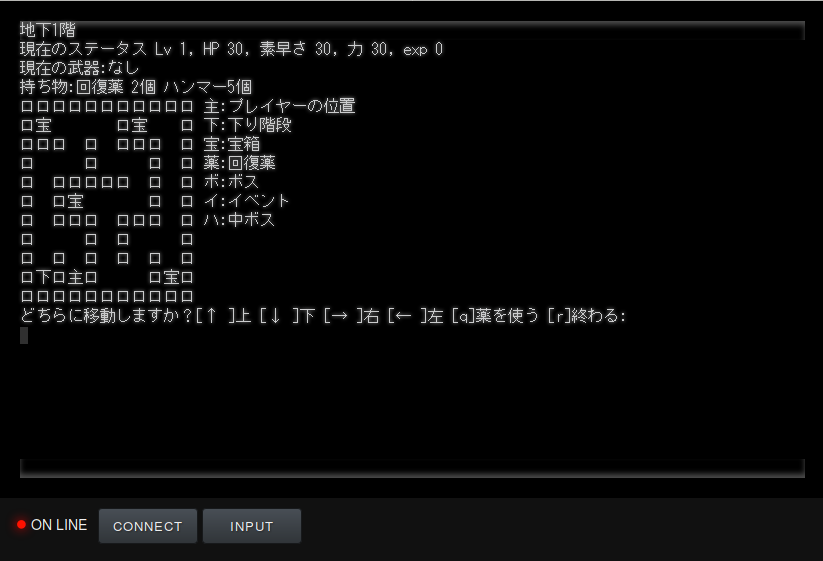

# mogeweb

もげRPGをブラウザで遊べるようにするもの。

## 1. 依存ライブラリをインストールする

    npm install
    bower install
    gem install colorize sxp

`mogerpg.exe` をリポジトリのディレクトリにコピーする。

## 2. 端末サーバーを起動する。

    nodejs index.js

## 3. index.html をブラウザで開く。

Web サーバーを介さずローカルファイルとして開いて構いません。
