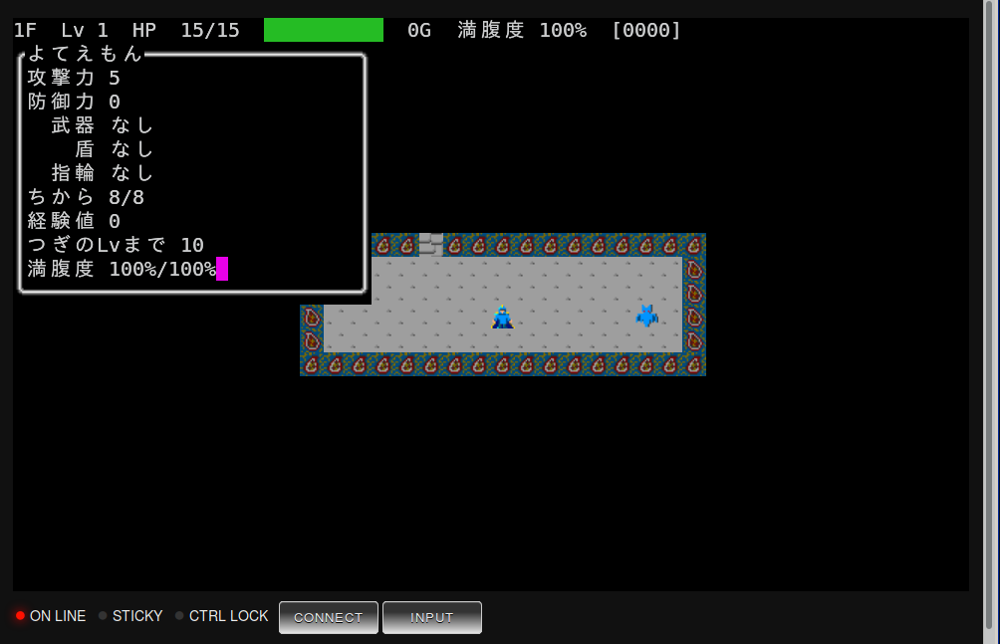

# mogeweb

ブラウザ用端末エミュレータ。DECPS 機能によるメロディ再生機能や、DRCS
(アプリケーション定義の外字)を利用する機能があります。

エスケープシーケンスは xterm 互換の方針です。

## 1. 依存ライブラリをインストールする

    npm install
    bower install

## 2. matter-module/matter-module.js を作成する

    make -C matter-module

## 3. サーバーを起動する。

コマンドの文法は `nodejs index.js HOST PORT COMMAND [ARGS...]` です。
WebSocket をバインドするIPアドレス(ホスト名)とポート番号に続いて、クラ
イアントに提供するプログラムと、そのプログラムに渡すコマンドライン引数
を指定します。

たとえばポート 8888 でシェルを提供したい場合は、

    nodejs index.js localhost 8888 bash

と指定してください。

## 4. index.html をブラウザで開く。

config.js の URL を書き換えて、先に起動したサーバーのIPアドレスとポー
ト番号を指定します。

次にブラウザで index.html を開いてください。うまくいけば動きます。

## FAQ

* 入力した単語を削除しようと Ctrl+W を入力したらブラウザのタブが閉じて
  しまいました。

ブラウザの基本的な操作を行うキーバインド(Ctrl+N Ctrl+T Ctrl+W)は、Web
アプリケーションから利用することができません。

chrome の --app 引数を利用してページを開くか、スティッキーキー機能を使っ
てください。Ctrl キーを単独で押して離すと画面下部の STICKY インジケー
タが点灯して、次に入力するキーが Ctrl 修飾されます。
